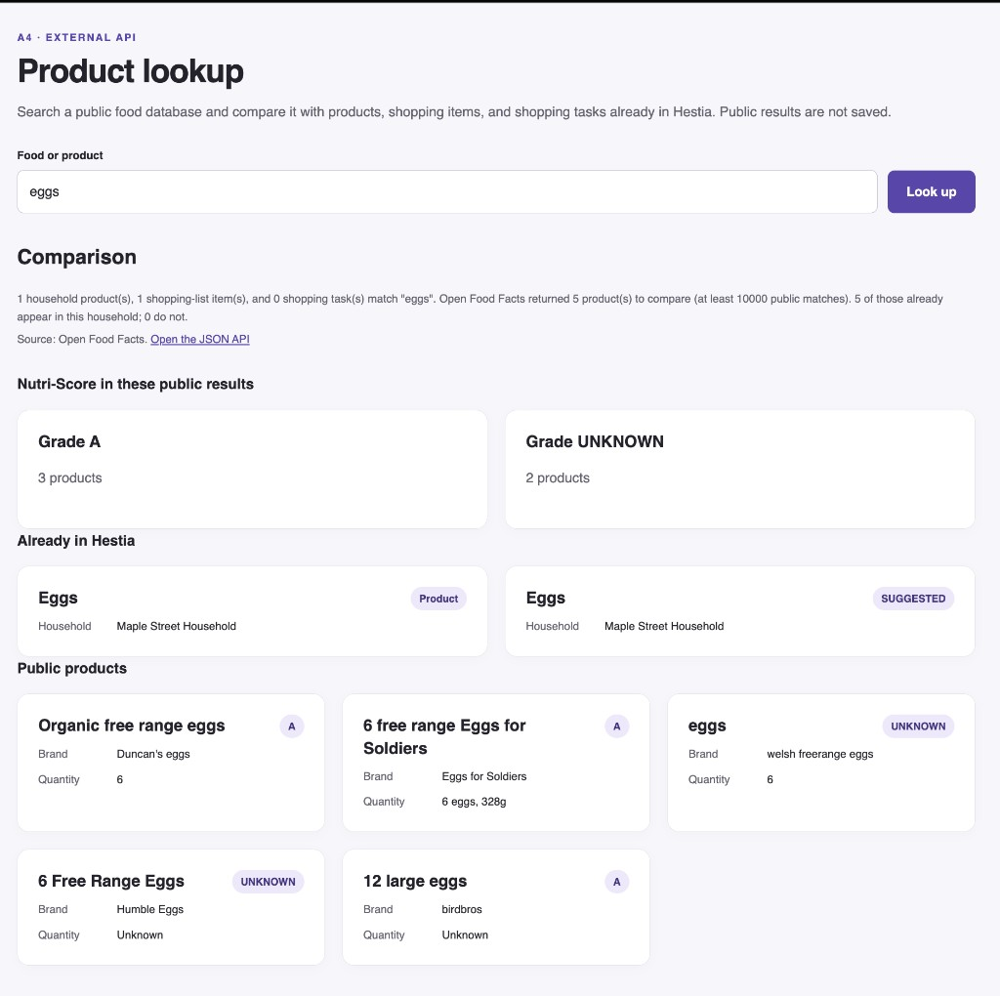

# A4 Person 2: External API

Product lookup compares a food search with Hestia's own records and with
[Open Food Facts](https://world.openfoodfacts.org/), a free public catalog that
does not require an API key. Open-Meteo is not used. Public products are shown
for the request only and are never written to the database.

## Routes

| What you open | URL |
| --- | --- |
| Search page | `/lookup/?q=eggs` |
| Same comparison as JSON | `/api/external/products/?q=eggs` |

The page is also linked as **Product lookup** in the main navigation. Both
routes accept `q` on a GET request. A missing search term asks for `?q=` and
does not call Open Food Facts. If that service cannot be reached, the view
returns an error instead of a traceback.

## What the eggs search shows

Open http://127.0.0.1:8000/lookup/?q=eggs with the development server running.
The screenshot below is that page on October 4, 2026.

The comparison line on that page is:

> 1 household product(s), 1 shopping-list item(s), and 0 shopping task(s) match "eggs". Open Food Facts returned 5 product(s) to compare (at least 10000 public matches). 5 of those already appear in this household; 0 do not.

Read it as four separate facts:

1. **Hestia already tracks eggs.** Maple Street Household has one product named Eggs.
2. **Someone already suggested buying them.** The same household has one shopping-list row named Eggs, still in the SUGGESTED state.
3. **Nobody has a shopping task for them yet.** No task title of type SHOPPING contains "eggs", so the task count is 0.
4. **The public catalog has many more egg products.** Open Food Facts reports at least 10,000 matches. The page keeps the first 5 so the comparison stays readable.

Those five public products are Organic free range eggs (Duncan's eggs, 6), 6 free range Eggs for Soldiers (6 eggs, 328 g), eggs (welsh freerange eggs, 6), 6 Free Range Eggs (Humble Eggs), and 12 large eggs (birdbros). Three have Nutri-Score A and two have no grade. That tally is calculated in Hestia from the five returned products. It is not a number stored in the database.

All five count as already in the household because each public name contains "eggs", and Maple Street's product is named Eggs. The match is a name comparison only. It does not mean those exact brands are on the shelf. A public name that did not contain "eggs" would be listed as new.

For the shopper, the page answers whether eggs are already tracked, whether they are already on a list, and which public pack sizes and Nutri-Score grades are available, without copying the catalog into Hestia.

**Open the JSON API** on that page opens `/api/external/products/?q=eggs`. The JSON has the same query, household rows, five public products, Nutri-Score counts, and already-in-household list. It does not include an HTML page.
